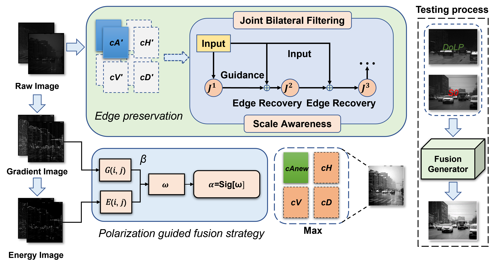

# PODB：: A learning-based polarimetric object detection benchmark for road scenes in adverse weather conditions
# (UPLOADING...)
Here is the official repository : [link](https://github.com/zhuz-bit/PODB/tree/main)
## We will share our work in three parts: **Dataset**, **Framework**, and **Evaluation**.
**----------------------------------------------------------------------------------------------------------------
**

# **First of All**
In particular, the polarimetric imaging technique has demonstrated significant advantages when handling object detection in road scenes. In adverse weather conditions, polarization imaging selectively receives and analyzes the vibration direction and intensity of light under different polarization directions, providing information about surface material properties, textures, and shapes [19], [20], reducing interference from haze particles, suppressing scattering from media particles, and eliminating interference from raindrops and snowflakes, thus providing richer and more accurate image information.

This study introduces the Polarized Object Detection Benchmark (PODB), a benchmark dataset that incorporates the physical dimension of optical polarization imaging to tackle object detection challenges in complex road scenes under adverse weather conditions. It specifically includes the establishment of a large-scale polarization dataset, the proposal of an enhanced detection model, and extensive algorithm evaluation.

To address issues such as poor object recognition accuracy under adverse weather conditions and the underutilization of the significant advantages of polarization imaging, we propose a Physics-based Multi-scale Image Fusion Cascaded Object Detection Neural Network model (PMIF-CODNN).

The proposed PODB aims to furnish researchers with an effective platform for the assessment and comparison of object detection algorithms, as well as provide researchers with a baseline for future studies in developing new DL-based methods, ultimately contributing to advancements in this field.

**----------------------------------------------------------------------------------------------------------------
**

# **Dataset**
